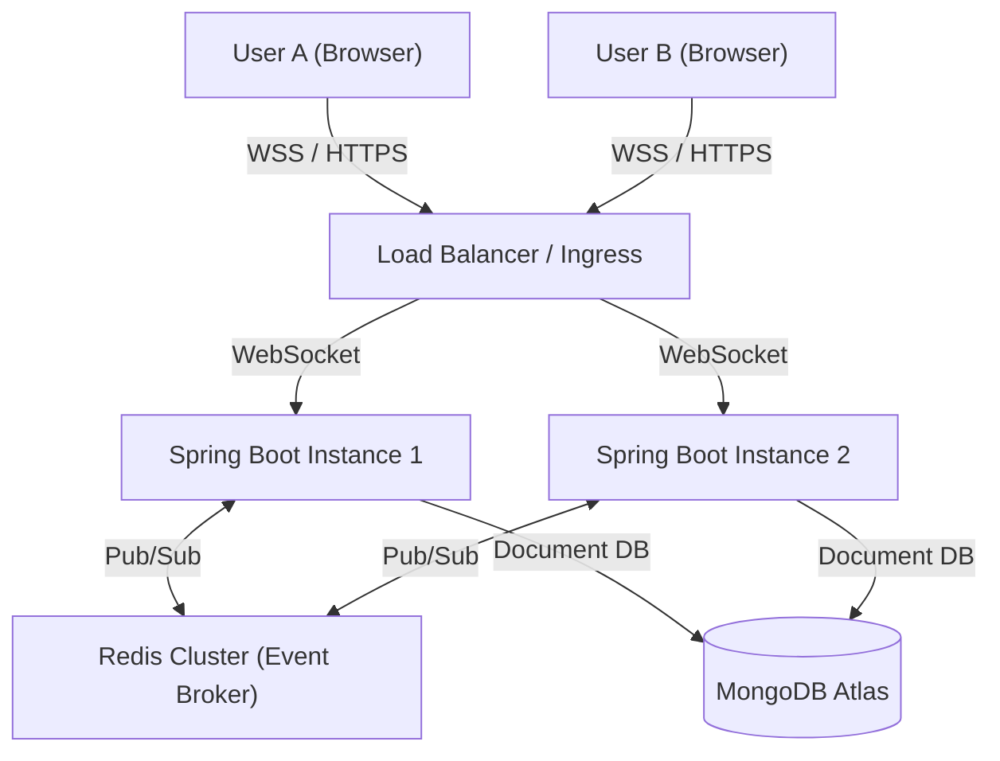

# SyncStream Architecture

SyncStream is designed as a distributed, horizontally scalable real-time chat application. It supports cross-server WebSocket synchronization, WebRTC signaling, End-to-End Encryption (E2EE), and a highly optimized React frontend.

## 1. System Overview

### Components
1. **Frontend (Vite + React)**: A React SPA that establishes a STOMP over WebSocket connection. It manages global state (auth, rooms, presence) via React Contexts and uses `react-virtuoso` for rendering hyper-performant virtualized message feeds.
2. **Backend (Spring Boot)**: A stateless, horizontally scalable API. It handles HTTP requests (auth, history) and maintains persistent WebSocket connections with active clients.
3. **Redis**: Acts as the central nervous system. It broadcasts presence events and chat messages across all backend nodes, ensuring that a user connected to Node 1 instantly receives messages from a user connected to Node 2.
4. **MongoDB**: The persistent data store for user profiles, encrypted message payloads, and GridFS chunked media files.

---

## 2. Real-Time Communication Protocols

### 2.1 STOMP over WebSockets
SyncStream utilizes the **STOMP (Simple Text Oriented Messaging Protocol)** on top of WebSockets. 
- WebSockets provide the full-duplex TCP connection.
- STOMP provides the routing semantics (e.g., `/topic/rooms/{id}`) so the frontend can subscribe to specific chat rooms without building custom multiplexing logic.

### 2.2 Redis Pub/Sub Synchronization
Since WebSockets are inherently stateful (a client connects to a specific server), multi-node scalability requires an event broker. 
- When a user sends a message to `/app/chat`, the server receives it, persists it to MongoDB, and publishes it to a Redis topic.
- **Every** backend node is subscribed to this Redis topic. When they receive the payload from Redis, they route it to their local WebSocket subscribers on `/topic/rooms/{id}`.
- This decoupling allows the backend cluster to scale infinitely.

---

## 3. WebRTC Peer-to-Peer Signaling

SyncStream supports direct Video, Audio, and Screen Sharing through WebRTC. WebRTC requires a signaling server to negotiate the connection (exchange SDP offers, answers, and ICE candidates).

**The Signaling Flow:**
1. User A initiates a call by generating an SDP Offer.
2. The Offer is sent to the backend via WebSocket (`/app/webrtc/signal`).
3. The backend routes the signal payload to User B via STOMP (`/topic/webrtc/{roomId}`).
4. User B responds with an SDP Answer.
5. Both users exchange ICE candidates to discover the optimal network route.
6. The WebSocket connection steps out of the way, and a direct, encrypted, low-latency UDP stream is established between the browsers.

---

## 4. End-to-End Encryption (E2EE)

Direct Messages in SyncStream feature absolute zero-knowledge End-to-End Encryption using the native browser **Web Crypto API**.

### Key Exchange (ECDH)
- **Curve**: P-256 (Elliptic Curve Diffie-Hellman).
- When a user signs up, the browser generates a public/private key pair. 
- The private key is securely wrapped and stored in the browser's `IndexedDB`. The public key is uploaded to the backend.
- When User A messages User B, User A fetches User B's public key. Using their own private key and User B's public key, a **Shared Secret** is mathematically derived.

### Message Encryption (AES-GCM)
- The Shared Secret is passed through HKDF to derive a 256-bit AES-GCM encryption key.
- Every message payload is encrypted using this key along with a cryptographically secure random Initialization Vector (IV).
- The server only receives and stores ciphertext. It is mathematically impossible for the backend to read the messages.

---

## 5. High-Performance Virtualized UI

Rendering thousands of HTML elements for chat messages causes severe DOM bloat and browser lag. SyncStream solves this by combining **React Virtuoso** and **Framer Motion**:

1. **Virtualized DOM**: The app maintains a dynamic window over the chat history. As you scroll, elements are recycled and replaced with new data. Only the exact number of nodes required to fill the screen (plus a small buffer) exist in the DOM at any given time.
2. **Intersection Free**: Older iterations relied on clunky `IntersectionObservers` to detect scroll position. The virtualized list natively triggers `atBottomStateChange` callbacks to dispatch read receipts and handle auto-scrolling with zero layout thrashing.
3. **Micro-Animations**: Framer motion gracefully animates incoming messages (opacity fades and transforms) only for newly appended items, ensuring a buttery-smooth 60FPS experience without interrupting the virtualization engine.
