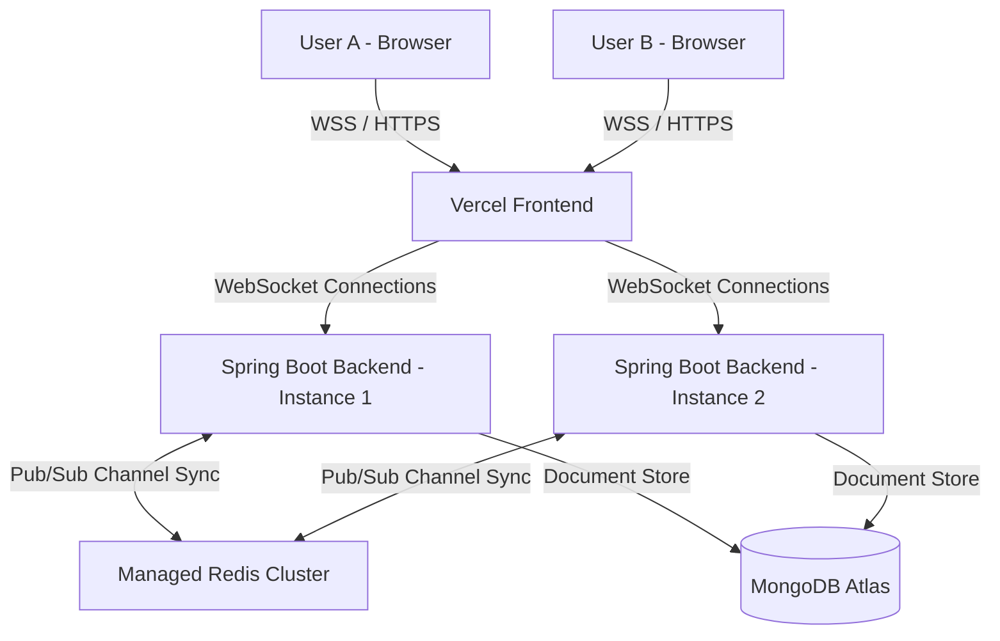

# SyncStream — Real-Time Collaborative Room Chat

SyncStream is a production-grade, real-time collaborative room chat application built with a multi-server, horizontally-scalable architecture. It features a React SPA frontend connected via STOMP WebSockets to a Spring Boot backend cluster synced using Redis Pub/Sub.

---

## Architecture Diagram



---

## Technology Stack

### Frontend
- **Framework**: React 18, TypeScript, Vite
- **Styling**: Tailwind CSS
- **Routing**: React Router v6
- **HTTP Client**: Axios (with JWT Interceptor)
- **WebSockets**: `@stomp/stompjs` (STOMP Protocol over WebSocket)
- **Iconography**: Lucide React

### Backend
- **Core**: Java 21, Spring Boot 3.3.2
- **Frameworks**: Spring Web, Spring WebSocket, Spring Security
- **Security**: JSON Web Tokens (JJWT), BCrypt password hashing
- **Databases**: Spring Data MongoDB, Spring Data Redis
- **Messaging**: Redis Pub/Sub (cross-instance message broker)
- **Compilation**: Maven (Multi-stage Docker builds)

---

## Repository Structure

```text
syncstream/
├── frontend/                     # React + Vite client SPA
│   ├── src/
│   │   ├── context/              # Auth & WebSocket STOMP Contexts
│   │   ├── pages/                # Landing, Auth, Dashboard, Chat room
│   │   ├── services/             # Axios API services
│   │   └── index.css             # Tailwind style definitions
│   ├── vercel.json               # SPA routing rewrite rule
│   └── Dockerfile                # Frontend development image
│
├── backend/                      # Spring Boot API & WS Server
│   ├── src/
│   │   ├── main/java/com/syncstream/
│   │   │   ├── config/           # Security, WS, & Redis configurations
│   │   │   ├── controller/       # Rest endpoints and WS Message Mappings
│   │   │   ├── dto/              # Auth & Presence DTOs
│   │   │   ├── listener/         # WS Session event hooks
│   │   │   ├── model/            # MongoDB entities
│   │   │   ├── pubsub/           # Redis Pub/Sub publisher/subscriber
│   │   │   ├── repository/       # MongoDB repositories
│   │   │   └── service/          # Business logic & sequence generators
│   │   └── main/resources/
│   │       └── application.yml   # App configurations
│   ├── pom.xml                   # Maven dependencies
│   └── Dockerfile                # Multi-stage JDK 21 compilation container
│
├── docker-compose.yml            # Local multi-server & DB orchestrator
├── .env.example                  # Environment configuration template
└── README.md                     # Documentation
```

---

## Features & Implementation

### 1. Multi-Server Sync (Redis Pub/Sub)
SyncStream is designed to be horizontally scalable. When a user connects to `Server 1` and posts a message, `Server 1` persists the message to MongoDB and publishes it to the Redis topic `syncstream:room:{roomId}`. `Server 2` is subscribed to that topic, receives the message payload, and broadcasts it to its locally connected WebSocket client sessions.

### 2. Message Reliability & Ordering
- **Sequence Numbers**: The backend assigns a monotonic, gap-free sequence number to each message per room using an atomic Redis counter. If Redis flushes, the backend queries MongoDB for the highest sequence number to prevent collisions.
- **Client Status tracking**: The UI displays messages in three states: `SENDING`, `SENT`, and `FAILED` (with retry triggers). Message duplicates are prevented by matching client-side UUIDs.
- **Missed Messages Recovery**: When the client reconnects after a drop, it determines its local maximum sequence number and calls `GET /api/rooms/{roomId}/messages/after?seq={maxSeq}` to seamlessly retrieve missed history buffer items.

### 3. Presence Tracking
User states (`ONLINE`, `AWAY`, `OFFLINE`) are cached in Redis with a 60-second Time-To-Live (TTL). The WebSocket connection triggers event listeners on connection and disconnection to update the presence cache and publish updates cluster-wide.

### 4. Typing Indicator
A custom debounced typing handler sends `isTyping=true` when a user keystroke occurs and delays `isTyping=false` for 2.5 seconds. Typing status changes are broadcasted via Redis Pub/Sub to prevent chat server scaling issues.

---

## Local Development (Docker Compose)

### Prerequisite
Ensure **Docker** and **Docker Compose** are installed and running.

### Quick Start
1. Clone the repository and navigate to the project folder.
2. Build and start the services:
   ```bash
   docker compose up --build
   ```
3. Access the services:
   - **Frontend**: [http://localhost:5173](http://localhost:5173)
   - **Backend 1**: [http://localhost:8081](http://localhost:8081)
   - **Backend 2**: [http://localhost:8082](http://localhost:8082)
   - **MongoDB**: Port `27017`
   - **Redis**: Port `6379`

### Multi-Server Verification Test
1. Open Browser Window A and navigate to the frontend. Register and log in. Create or enter the room `#general`.
2. Open Browser Window B (incognito) pointing to the same frontend. Log in as a different user and join `#general`.
3. Stop the `backend-1` server in Docker to simulate a load-balancer failover. The client connected to `backend-1` will transition to a reconnect state and reconnect to `backend-2`, pulling any missed messages seamlessly.

---

## Production Deployment

### Frontend (Vercel)
1. Import the `/frontend` directory to Vercel.
2. Select **Vite** framework preset.
3. Configure the Production Environment Variables:
   - `VITE_API_BASE_URL` = `https://your-backend-api.com`
   - `VITE_WS_URL` = `wss://your-backend-api.com/ws`

### Backend (Persistent Server)
Deploy the `/backend` folder using the included multi-stage Dockerfile to a JVM-compatible host. Configure environment variables matching the production setup:
- `PORT` = (Assigned by hosting provider)
- `SPRING_DATA_MONGODB_URI` = (MongoDB Atlas Connection String)
- `SPRING_DATA_REDIS_HOST` & `PORT` & `PASSWORD` = (Managed Redis credentials)
- `JWT_SECRET` = (Secure base64/hex key)
- `FRONTEND_URL` = `https://your-vercel-domain.vercel.app` (for secure CORS mapping)
