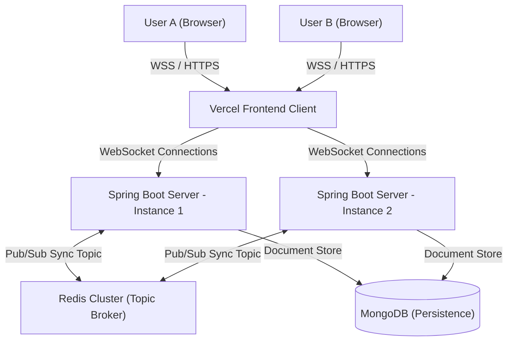
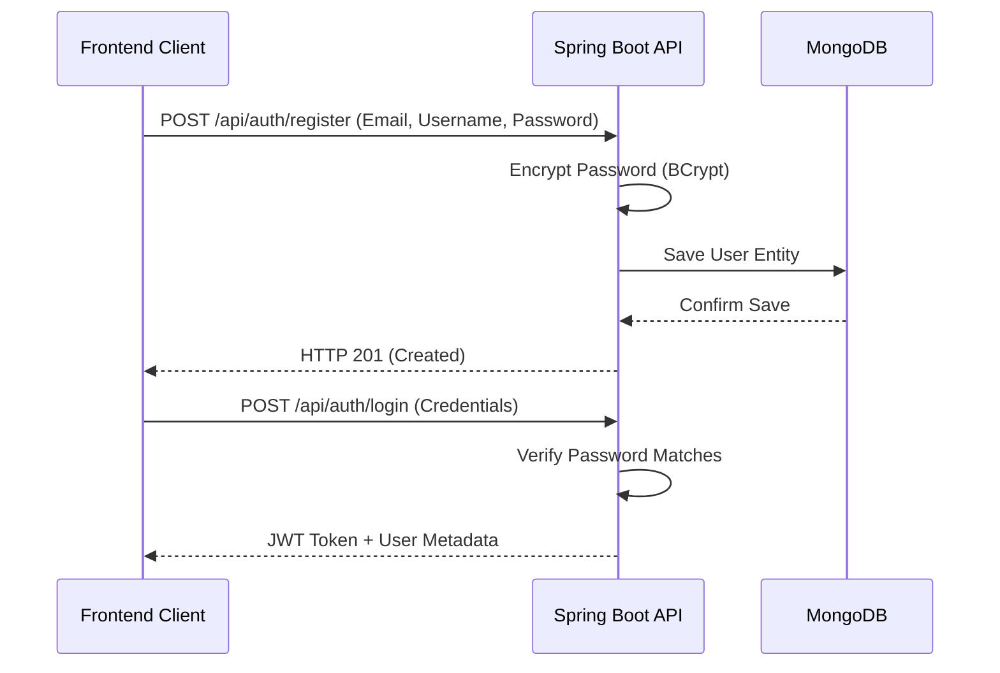
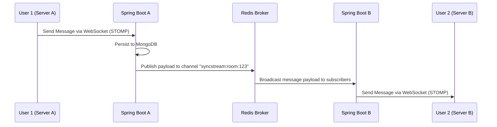
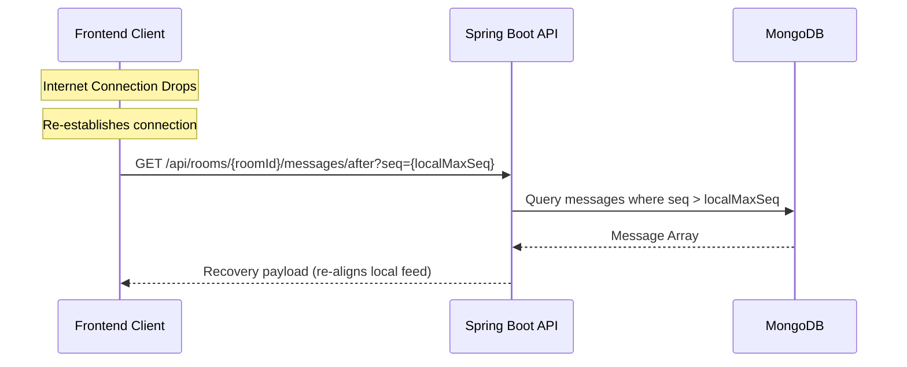
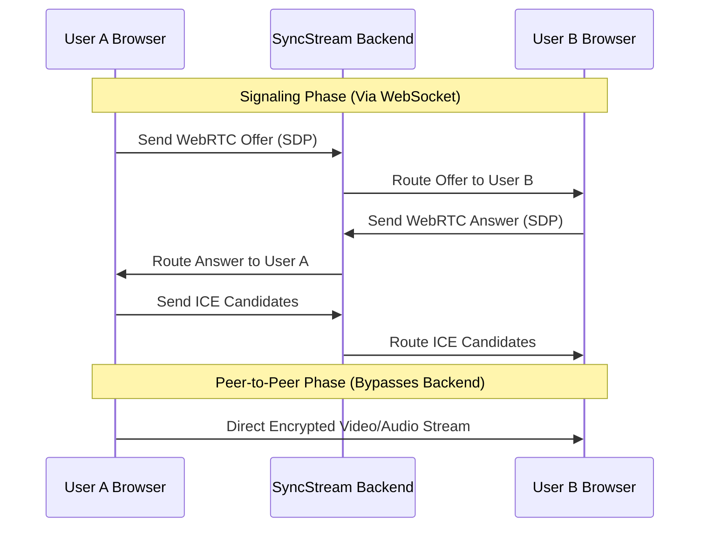

# SyncStream — Real-Time Collaborative Room Chat

SyncStream is a production-grade, real-time collaborative room chat application built with a multi-server, horizontally-scalable architecture. It features a React SPA frontend connected via STOMP WebSockets to a Spring Boot backend cluster synced using Redis Pub/Sub.

---

## Why SyncStream?

SyncStream was engineered to solve a fundamental challenge in real-time communication: **How do we build an interface that feels rich, beautiful, and fluid, while ensuring the underlying architecture can scale horizontally to support millions of concurrent connections?**

Most collaborative chat projects fall into one of two traps: either they are visually simple and lack modern styling, or their server layers cannot scale beyond a single thread. SyncStream bridges this gap by combining:
* **Rich Premium Aesthetics**: A glassmorphic design system featuring HSL-curated color tones, custom typography, dynamic theming, and dynamic spring micro-animations.
* **Feature-Packed Workspaces**: Fully integrated with WebRTC Video/Audio calling, Markdown-rendered chat streams, GridFS file sharing, and cross-server Redis push notifications.
* **Horizontal Scalability**: A distributed backend cluster synchronized via Redis Pub/Sub to allow users on different server instances to chat instantly.
* **Guaranteed Reliability**: Sequence-numbered message buffers, connection presence caching, and automatic recovery protocols for network dropouts.

---

## Core Features

- 💬 **Real-Time Group Chat**: Scalable room-based messaging using STOMP WebSockets and Redis Pub/Sub.
- 📹 **WebRTC Video & Audio Calling**: Low-latency peer-to-peer media streaming with dynamic grid and Presentation mode layouts for screen sharing.
- 🎨 **Dynamic UI Theming**: Real-time context-driven CSS variable overrides, allowing users to customize their workspace accent colors without page reloads.
- 📝 **Markdown & Code Rendering**: Full support for GitHub-flavored markdown, code block syntax highlighting, and text formatting inside chat.
- 📁 **File & Media Attachments**: Seamlessly upload and share images, PDFs, and code snippets powered by MongoDB GridFS chunked streaming.
- 🔔 **Targeted Push Notifications**: Global Redis event broadcasting that maps `@mentions` and alerts across specific user sessions regardless of which server node they are connected to.

---

## Architecture Diagram



---

## Frontend Routing Map (Paths)

The React SPA router manages the following endpoints:

| Route Path | View Component | Description | Access Level |
|:---|:---|:---|:---|
| `/` | `LandingPage` | Interactive workspace preview, feature lists, and branding layout | Public |
| `/login` | `LoginPage` | Glassmorphic form with floating badges and social auth options | Public |
| `/register` | `RegisterPage` | Signup form with real-time password complexity analyzer | Public |
| `/dashboard` | `DashboardPage` | Workspace overview statistics, unread room alerts, and recent activities | Authenticated |
| `/rooms` | `RoomsPage` | Searchable directory list of rooms, creation shortcuts, and pagination | Authenticated |
| `/rooms/:roomId`| `RoomChatPage` | Core chat screen, file attachments, online members panel | Authenticated |
| `/profile` | `ProfilePage` | Settings panel for preferences, activity logs, and 2FA configuration | Authenticated |

---

## Designs & Styling System

SyncStream features a meticulously crafted styling system built on custom CSS properties and Tailwind tokens inside [`index.css`](file:///d:/ASHISH%20GITHUB/SyncStream/frontend/src/index.css):

### Visual Mockups Recreation
* **Landing Page Mockup Frame**: Displays a complete three-column preview of the app workspace, showcasing a simulated channels sidebar, feed, and members list in real time.
* **Segmented Password Strength Indicator**: A 5-segmented color progress bar underneath password inputs that analyzes password complexity (`Weak`, `Medium`, `Strong`) dynamically.
* **Breadcrumb Navigation Tracks**: Navigation trails (`Profile > Overview`) present across administrative views for clear user orientation.
* **Two-Factor Authentication Settings**: Premium security cards detailing system status with active indicator pills (`Enabled ✓`).

### Animation & Motion Easing
* **`.animate-fade-in-up`**: Smooth entry animations for all page layouts.
* **`.animate-scale-in`**: Modal popups, alerts, and badges spring into place.
* **`hover:scale-[1.02] active:scale-[0.98]`**: Micro-scale interactions on stats cards, list items, and reaction buttons to provide satisfying tactile feedback.

---

## Workflows

### 1. User Authentication & Security Flow


### 2. Horizontal Messaging Synchronization (Redis Pub/Sub)


### 3. Reconnection & History Recovery Flow


### 4. WebRTC Signaling Flow


---

## Key Use Cases

1. **Horizontal Enterprise Team Collaboration**: Deploy SyncStream to multi-container Kubernetes nodes where team members remain connected to separate instances but can interact instantaneously with zero message lag.
2. **Persistent Discussion Hubs**: Users can create rooms for project areas, track online presence, read pinned announcements, share large files, and scroll through complete history logs.
3. **Seamless Video Conferences**: Users can join a room and jump directly into a WebRTC video call with zero external plugins, utilizing dynamic Presentation Mode for easy screen sharing.
4. **Secure Workspace Control**: Administrators can secure their credentials using segmented passwords, track recent log activities, and manage preference settings.

---

## Technology Stack

### Frontend
- **Framework**: React 18, TypeScript, Vite
- **Styling**: Tailwind CSS & Custom CSS Keyframe Easing
- **Routing**: React Router v6
- **HTTP Client**: Axios (with JWT Interceptor)
- **WebSockets**: `@stomp/stompjs` (STOMP Protocol over WebSocket)
- **Iconography**: FontAwesome & Lucide React

### Backend
- **Core**: Java 21, Spring Boot 3.3.2
- **Frameworks**: Spring Web, Spring WebSocket, Spring Security
- **Security**: JSON Web Tokens (JJWT), BCrypt password hashing
- **Databases**: Spring Data MongoDB, Spring Data Redis
- **Messaging**: Redis Pub/Sub (cross-instance message broker)
- **Compilation**: Maven (Multi-stage Docker builds)

---

## Repository Structure

```text
syncstream/
├── frontend/                     # React + Vite client SPA
│   ├── src/
│   │   ├── context/              # Auth & WebSocket STOMP Contexts
│   │   ├── pages/                # Landing, Auth, Dashboard, Chat room
│   │   ├── services/             # Axios API services
│   │   └── index.css             # Tailwind + Custom keyframes definitions
│   ├── vercel.json               # SPA routing rewrite rule
│   └── Dockerfile                # Frontend development image
│
├── backend/                      # Spring Boot API & WS Server
│   ├── src/
│   │   ├── main/java/com/syncstream/
│   │   │   ├── config/           # Security, WS, & Redis configurations
│   │   │   ├── controller/       # Rest endpoints and WS Message Mappings
│   │   │   ├── dto/              # Auth & Presence DTOs
│   │   │   ├── listener/         # WS Session event hooks
│   │   │   ├── model/            # MongoDB entities
│   │   │   ├── pubsub/           # Redis Pub/Sub publisher/subscriber
│   │   │   ├── repository/       # MongoDB repositories
│   │   │   └── service/          # Business logic & sequence generators
│   │   └── main/resources/
│   │       └── application.yml   # App configurations
│   ├── pom.xml                   # Maven dependencies
│   └── Dockerfile                # Multi-stage JDK 21 compilation container
│
├── docker-compose.yml            # Local multi-server & DB orchestrator
├── .env.example                  # Environment configuration template
└── README.md                     # Documentation
```

---

## Local Development (Docker Compose)

### Prerequisite
Ensure **Docker** and **Docker Compose** are installed and running.

### Quick Start
1. Clone the repository and navigate to the project folder.
2. Build and start the services:
   ```bash
   docker compose up --build
   ```
3. Access the services:
   - **Frontend**: [http://localhost:5173](http://localhost:5173)
   - **Backend 1**: [http://localhost:8081](http://localhost:8081)
   - **Backend 2**: [http://localhost:8082](http://localhost:8082)
   - **MongoDB**: Port `27017`
   - **Redis**: Port `6379`
