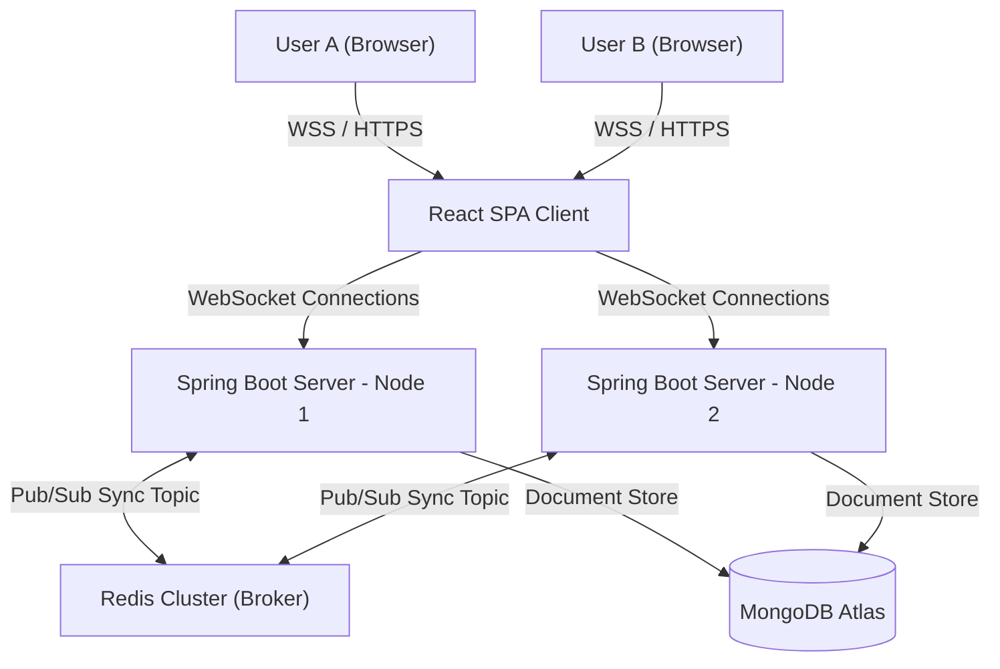

<div align="center">
  
  
  
  
  
  
</div>

<h1 align="center">SyncStream — Collaborative Real-Time Workspace</h1>

<p align="center">
  <strong>A production-grade, horizontally scalable real-time chat and collaboration platform.</strong>
</p>

> **Note**: For a deep dive into the underlying distributed systems and protocols, please see the [Architecture Documentation](ARCHITECTURE.md).

---

## 🚀 Why SyncStream?

SyncStream was engineered to solve a fundamental challenge in real-time communication: **How do we build an interface that feels rich, beautiful, and fluid, while ensuring the underlying architecture can scale horizontally to support millions of concurrent connections?**

Most collaborative chat projects fall into one of two traps: either they are visually simple and lack modern styling, or their server layers cannot scale beyond a single thread. SyncStream bridges this gap by combining:
* **Rich Premium Aesthetics**: A glassmorphic design system featuring custom typography, dynamic theming, and Framer Motion micro-animations.
* **Feature-Packed Workspaces**: Fully integrated with WebRTC Video/Audio calling, Markdown-rendered chat streams, Collaborative Whiteboarding, Tic-Tac-Toe, and cross-server Redis push notifications.
* **Horizontal Scalability**: A distributed backend cluster synchronized via Redis Pub/Sub to allow users on different server nodes to chat instantly.
* **Zero-Knowledge Security**: Absolute End-to-End Encryption (E2EE) for Direct Messages powered by the Web Crypto API.

---

## ✨ Core Features

- 💬 **High-Performance Virtualized Chat**: Utilizes `react-virtuoso` to render only the visible viewport of messages. Capable of smoothly scrolling through 10,000+ messages with zero DOM lag.
- 📹 **WebRTC Video & Audio Calling**: Low-latency peer-to-peer media streaming with dynamic grid layouts and Presentation mode for screen sharing.
- 🔒 **End-to-End Encryption (E2EE)**: Secure Direct Messages using AES-GCM and ECDH key exchange. The server only sees encrypted ciphertext.
- 🎨 **Real-Time Whiteboard**: A collaborative drawing canvas synced over WebSockets, allowing multiple users to sketch ideas instantly.
- 🕹️ **Interactive Games**: Play real-time Tic-Tac-Toe directly inside a chat room!
- 🛡️ **Custom Roles & Permissions**: Granular room moderation capabilities including `PIN_MESSAGES`, `MUTE_USERS`, and `READ_ONLY` assignments.
- 📝 **Markdown & Code Rendering**: Full support for GitHub-flavored markdown, syntax highlighting, and text formatting inside chat.
- 📁 **File & Media Attachments**: Seamlessly upload and share images, PDFs, and code snippets powered by MongoDB GridFS chunked streaming.
- 🔊 **Audio Feedback**: Native Web Audio API integrations for instant, zero-dependency notification sounds without downloading static `.mp3` assets.
- 🚥 **Rich User Presence**: Detailed status indicators, custom "listening to Spotify" presences, and automatic offline fallback mechanisms.

---

## 🏗️ Quick Architecture Overview

SyncStream uses a multi-node backend architecture synchronized by Redis. When User A (on Node 1) sends a message to User B (on Node 2), the payload is passed through the Redis event broker.



---

## 🧪 CI/CD & Testing

The repository maintains a strict standard of quality assurance powered by GitHub Actions. Every push to `main` triggers:
1. **Backend Verification**: `mvn clean verify` ensures the Spring Boot environment compiles and all JUnit integration/unit tests pass.
2. **Frontend Build**: Vite and TypeScript execute rigid type-checking.
3. **E2E Testing**: Cypress is launched headlessly against the compiled React SPA, navigating through authentication, chat, and room flows automatically.
4. **Dockerization**: The output is packaged into isolated multi-stage Docker containers ready for Kubernetes deployment.

---

## 🛠️ Local Development (Docker Compose)

### Prerequisite
Ensure **Docker** and **Docker Compose** are installed and running on your machine.

### Quick Start
1. Clone the repository and navigate to the project folder.
2. Build and start the cluster:
   ```bash
   docker compose up --build
   ```
3. Access the services:
   - **Frontend**: [http://localhost:5173](http://localhost:5173)
   - **Backend Node 1**: `http://localhost:8081`
   - **Backend Node 2**: `http://localhost:8082`
   - **MongoDB**: Port `27017`
   - **Redis**: Port `6379`
