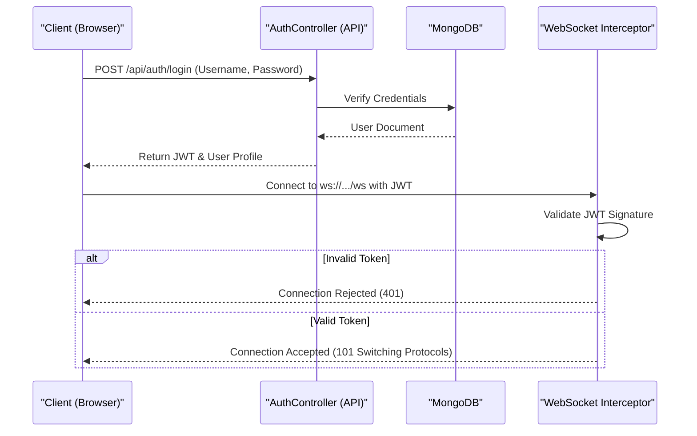
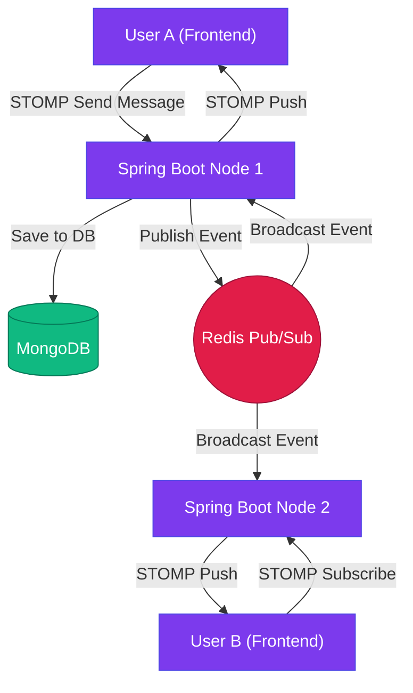
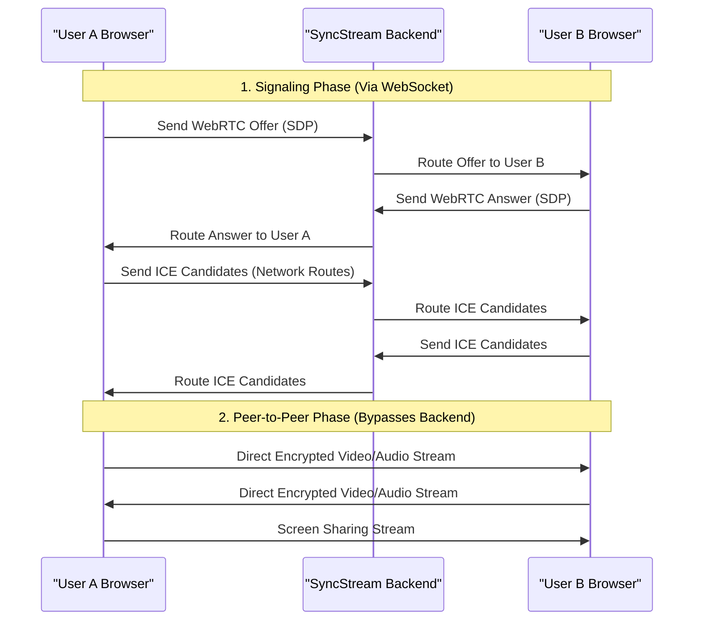
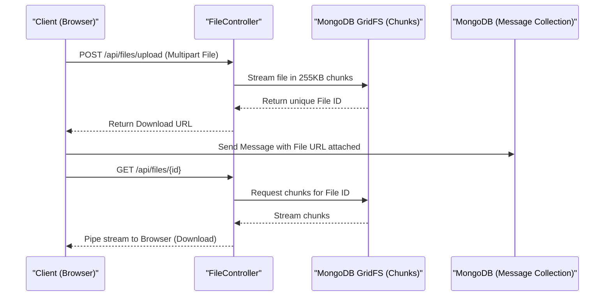
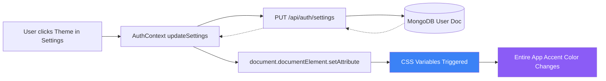

# SyncStream: Visual System Workflows

This document visually maps out the end-to-end architectures and data flows for all the major features in SyncStream using Mermaid diagrams.

---

## 1. Authentication & Connection Workflow
**Goal:** Securely identify users and establish a verified real-time connection.

---

## 2. Real-Time Messaging & Presence (Redis Pub/Sub)
**Goal:** Deliver instant messages to users across multiple server instances.

---

## 3. Video & Audio Calling (WebRTC)
**Goal:** Peer-to-peer, low-latency media streaming bypassing the central server.

---

## 4. File Sharing & Attachments (GridFS)
**Goal:** Stream large files safely using MongoDB GridFS.

---

## 5. Personalization & Theming
**Goal:** Change UI themes instantly across the application without reloading.

---

## 6. End-to-End User Journey (Page Navigation Flow)
**Goal:** Map out the exact UI navigation paths a user takes from opening the app to interacting inside a room.

