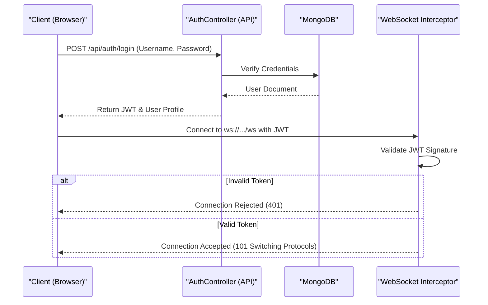
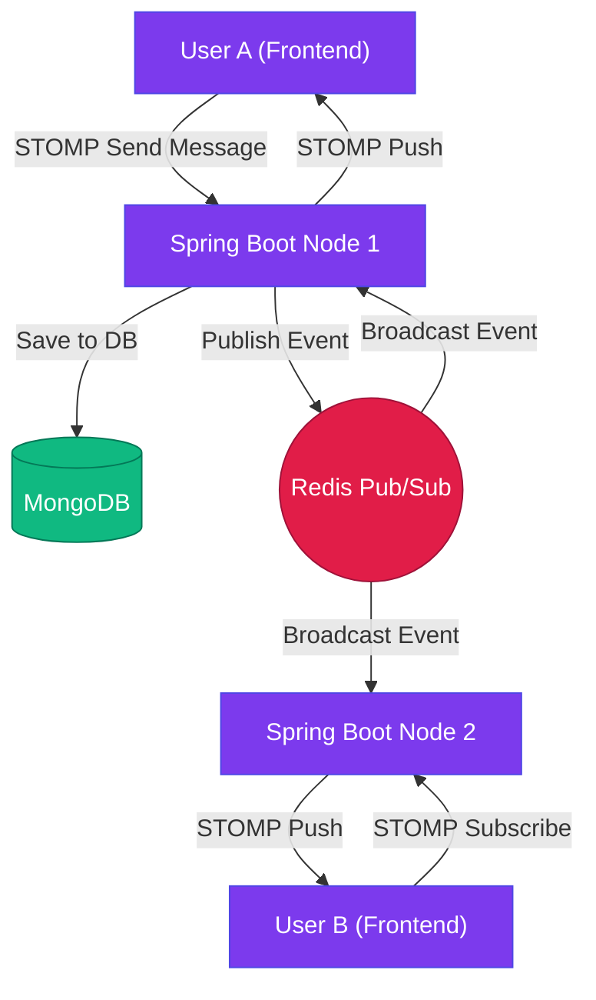
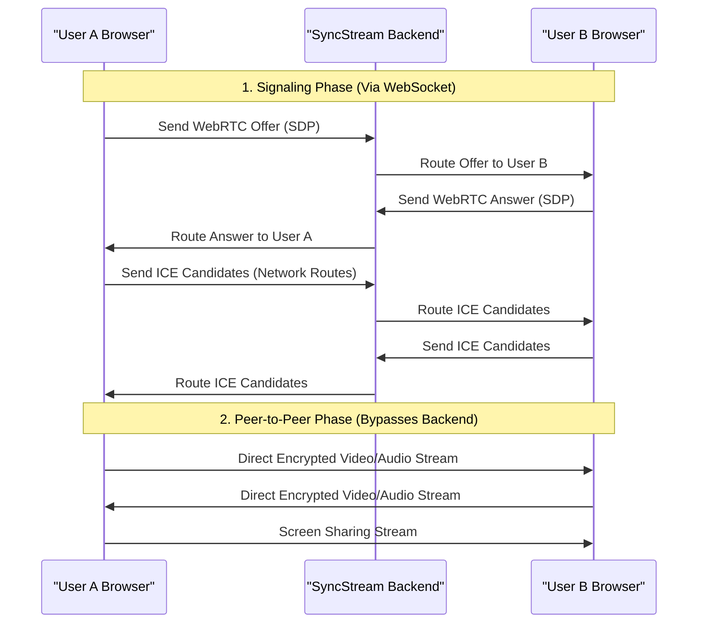
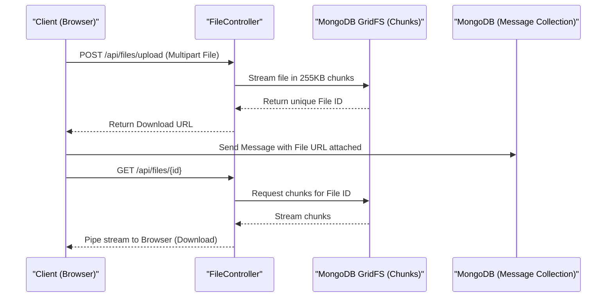
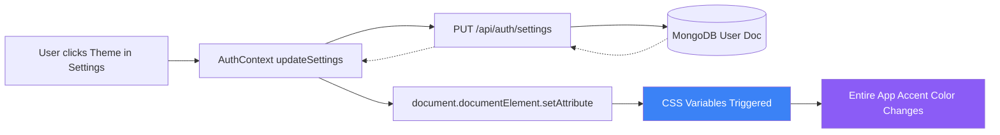
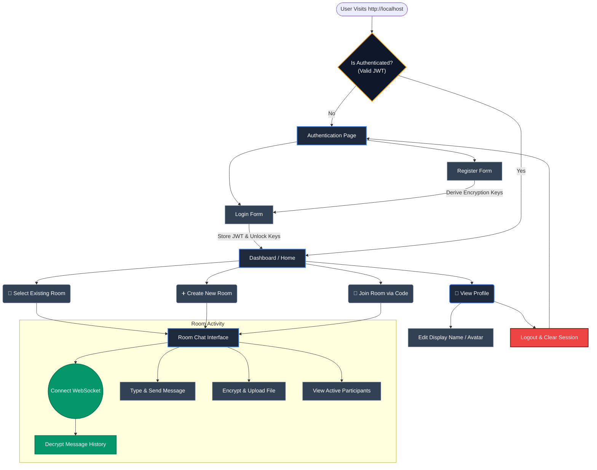
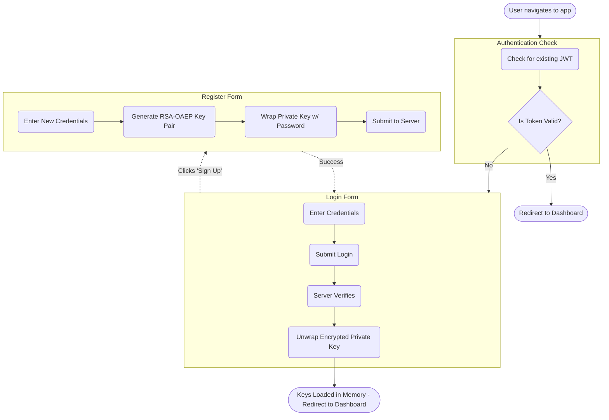
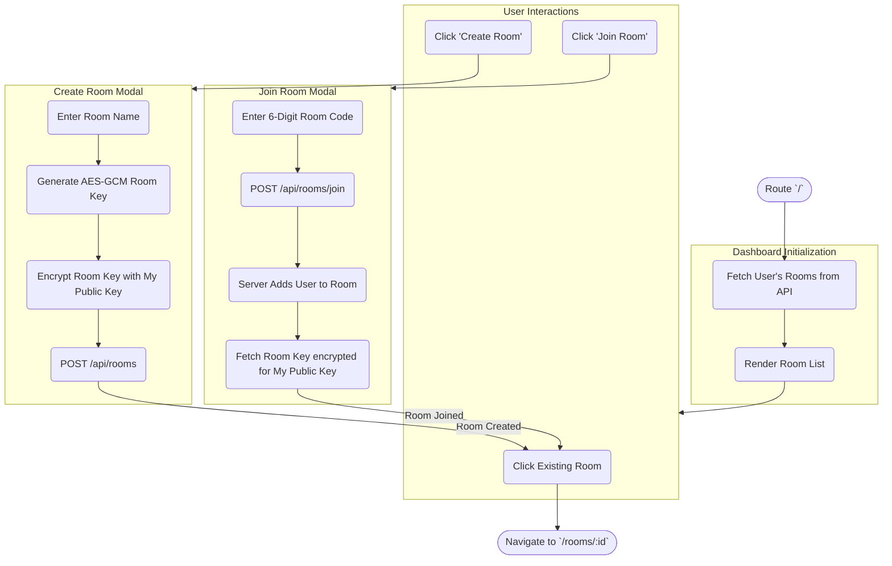
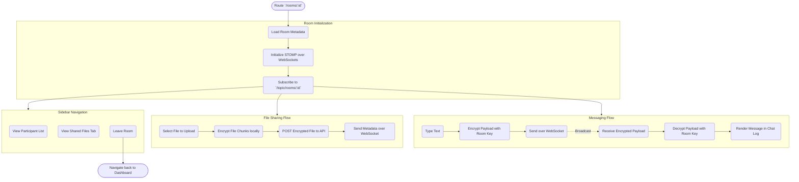
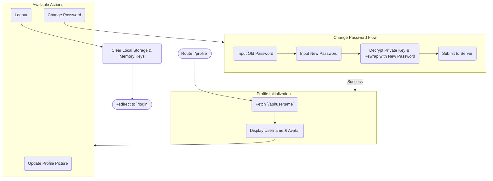

# SyncStream: Visual System Workflows

This document visually maps out the end-to-end architectures, data flows, and user journeys for all the major features in SyncStream using Mermaid diagrams.

---

## 1. Authentication & Connection Workflow
**Goal:** Securely identify users and establish a verified real-time connection.

---

## 2. Real-Time Messaging & Presence (Redis Pub/Sub)
**Goal:** Deliver instant messages to users across multiple server instances.

---

## 3. Video & Audio Calling (WebRTC)
**Goal:** Peer-to-peer, low-latency media streaming bypassing the central server.

---

## 4. File Sharing & Attachments (GridFS)
**Goal:** Stream large files safely using MongoDB GridFS.

---

## 5. Personalization & Theming
**Goal:** Change UI themes instantly across the application without reloading.

---

## 6. End-to-End User Journey
**Goal:** Map out the high-level user journey and navigation paths throughout the SyncStream frontend application.

---

## 7. Individual Page Workflows

### 7.1. Authentication Page (`/login` & `/register`)
Handles user identity verification and local cryptographic key generation.

### 7.2. Dashboard / Rooms Page (`/`)
The central hub where users manage and discover their chat rooms.

### 7.3. Room Chat Page (`/rooms/:id`)
The core real-time messaging and file sharing interface.

### 7.4. Profile Settings Page (`/profile`)
Where the user manages their account and session.

